# SilverCare AI Assistant (银龄智护)

<div align="center">

**Voice-First Accessible In-Home Care Assistance & Risk Early-Warning System**  
*A multimodal AI assistive system for low-vision seniors, solitary elders, and long-term care scenarios*

[Key Capabilities](#key-capabilities) • [Live Scenarios & Demos](#live-scenarios--demos) • [System Architecture](#system-architecture) • [Edge-Cloud Strategy](#edge-cloud-coordination--model-strategy) • [Build Guide](#build--verification-guide) • [Public Benchmark](#public-benchmark) • [Compliance & Disclaimer](#compliance--disclaimer)

</div>

---

## Overview

**SilverCare AI Assistant (银龄智护)** is a multimodal artificial intelligence system tailored for low-vision seniors, solitary elderly individuals, semi-disabled care recipients, family caregivers, and long-term care management professionals. Running directly on standard commodity smartphones as perception and computing terminals, the system integrates smartphone cameras, high-sensitivity microphones, 6-axis IMU sensors, edge deep-learning engines, and optional cloud LLM services. It delivers a comprehensive solution combining **"Multimodal Environmental Perception + Voice-First Interaction + In-Home Mobility Guidance + Active Fall Verification + Closed-Loop Care Management"**.

The system delivers actionable, clear verbal mobility guidance and proactive hazard alerts while elderly individuals move around their homes independently. Simultaneously, it provides an auditable event review trail for family members and professional caregivers. By translating continuous camera streams into tactile anchors and body-relative spatial directions (such as *"Pause immediately; step right; hold the door frame; gently probe the floor with your toes; slide your hand forward along the table edge"*), the system enables individuals with mobility limitations or declining eyesight to complete essential daily tasks—including nighttime bathroom visits, corridor walking, obstacle navigation, and item retrieval—with safety and autonomy.

<div align="center">
  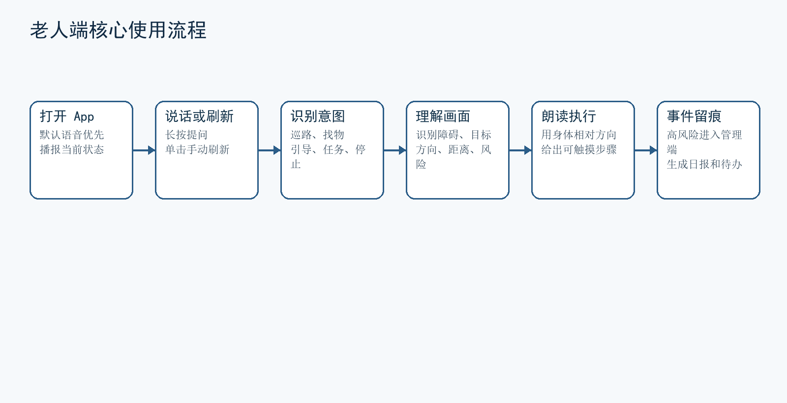
  <p><em>Figure 1: Voice-First Elderly Core Interaction Flow</em></p>
</div>

---

## Key Capabilities

- 🎙️ **Voice-First Accessible Interaction**: Features full-chain spoken prompts, high-contrast large subtitles, and enlarged touch areas by default. Supports press-to-speak, single-tap refresh, and hands-free automatic broadcast, allowing fluid operation without requiring sustained screen gaze.
- 🚶 **Nighttime Patrolling & Mobility Guidance**: Continuously monitors ground paths and passageways, automatically recognizing floor mats, thresholds, power cords, stairs, and furniture edges to generate concise verbal detour guidance.
- 🔍 **Homophone Correction & Spoken Object Finding**: Enables rapid localization of everyday essentials (water cups, medicine bottles, keys, reading glasses). Combines ASR phonetic correction with object detection to announce target positions and flag co-occurring nearby hazards.
- 🤝 **Fine-Grained Action Guidance**: Supports delicate operations such as passing through narrow doorways, reaching wall switches, and picking up table items using body-relative directions and physical tactile anchors.
- 🛡️ **Dual-Insurance Fall Confirmation**: Fuses IMU acceleration impact peaks, abnormal body tilt angles, and temporal visual frame disruptions. Once triggered, the system initiates an active spoken query with a 10-second countdown, filtering out false alarms caused by casual device drops or minor tremors.
- 📊 **Closed-Loop Care Management**: Seamlessly connects mobile applications with a desktop Web management console, aggregating hazard warnings, failed item searches, and emergency queries into structured ledgers while generating automated daily AI care summaries for caregiver verification.
- ⚡ **Edge-First Offline & Cloud Coordination**: Fully operational offline via MNN Runtime + DAMO-YOLO + Qwen3 language model + lightweight local Vosk ASR, with optional cloud fallback to DashScope multimodal models to guarantee privacy, low latency, and high availability in weak-network environments.

---

## Live Scenarios & Demos

### 1. In-Home Patrolling & Nighttime Obstacle Avoidance

During low-light nighttime walks, narrow hallway navigation, and cluttered passage transit, the system dynamically detects upcoming obstacles, estimates relative distance, and broadcasts concise navigation instructions.

| Scenario A: Corridor Passage Navigation | Scenario B: Entrance Luggage & Obstacle Warning |
| :---: | :---: |
| 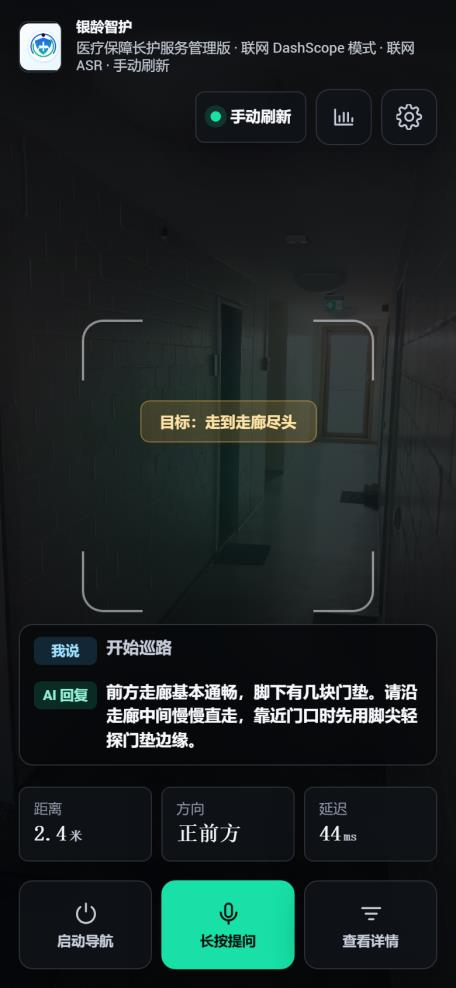 | 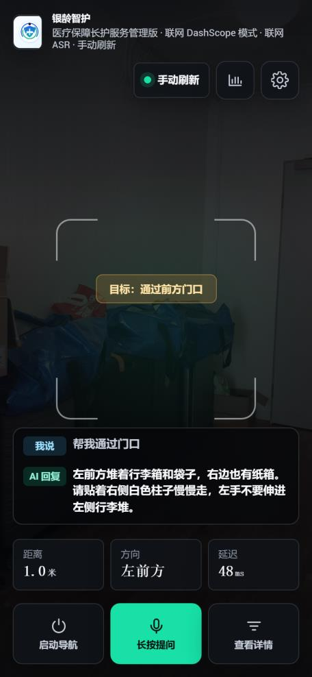 |
| **Detected Target**: Floor mat, corridor walking depth<br>**Spoken Guidance**: *"Walk slowly along the center of the corridor. A floor mat is ahead; watch your step."* | **Detected Target**: Stacked suitcases and bags in passageway<br>**Spoken Guidance**: *"Luggage stacked on the front-left. Keep to the right wall and move forward slowly."* |

---

### 2. Hazard Warning & Bathroom Safety

Focusing on common household fall triggers (fallen objects, tangled electrical wires, slippery bathroom tiles, and threshold height differentials), the system elevates warning priority and guides seniors to decelerate and use hand supports.

| Scenario C: Tripping Hazard Warning | Scenario D: Bathroom Slipping & Threshold Safety |
| :---: | :---: |
| 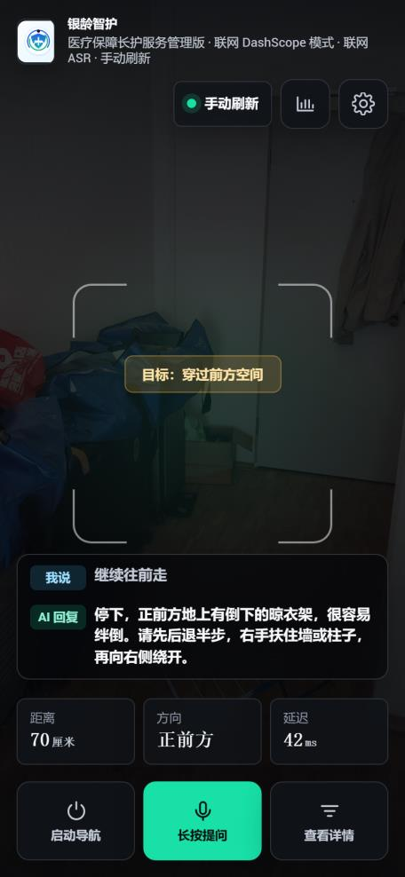 | 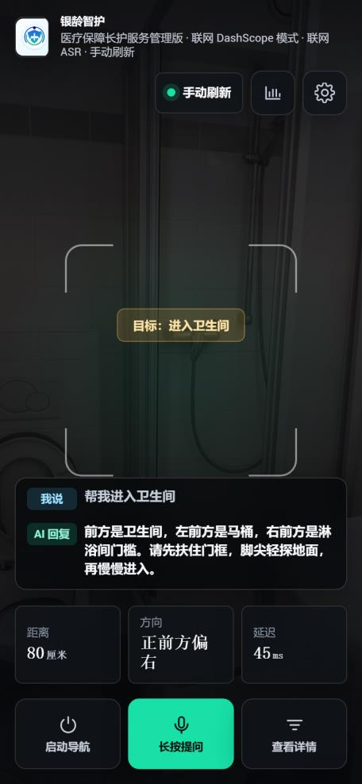 |
| **Detected Target**: Fallen metal drying rack blocking path<br>**Spoken Guidance**: *"Stop immediately! A fallen metal rack is right ahead. Step back half a pace and detour to the right."* | **Detected Target**: Threshold elevation, slick bathroom tiles, toilet position<br>**Spoken Guidance**: *"Entering the bathroom now. Hold the door frame firmly and probe the floor with your toes to check for moisture."* |

---

### 3. Object Retrieval & Precise Action Guidance

Users trigger retrieval requests via spoken queries (e.g., *"Help me find my blood pressure medicine"*, *"Where is my earphone case?"*). The system performs phonetic transcription correction, visual bounding box localization, and hazard analysis of the surrounding surface.

| Scenario E: Object Finding & Power Strip Risk | Scenario F: Dual-Insurance Fall Confirmation |
| :---: | :---: |
| 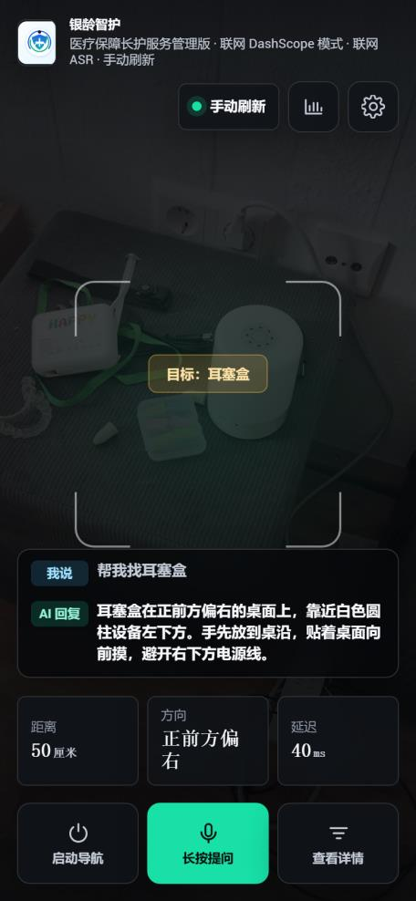 | 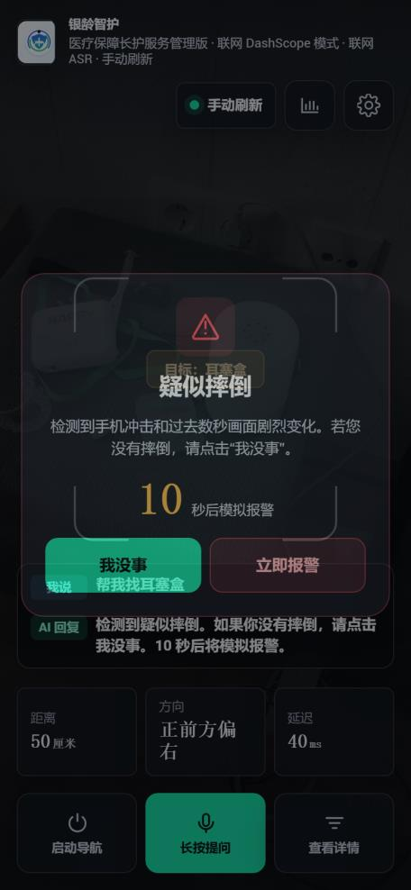 |
| **Detected Target**: Earphone case located on right side of desktop; power strip nearby<br>**Spoken Guidance**: *"The earphone case is on the desktop ahead, slightly to the right. Note the power strip and cords nearby; reach forward slowly."* | **Detected Trigger**: Gravitational impact + pitch tilt inversion + violent visual motion<br>**Workflow**: Displays a 10-second confirmation dialog with a loud voice prompt asking *"Did you fall?"*. Lack of response escalates to emergency contacts. |

---

### 4. Fall Confirmation & Closed-Loop Care Service

The system aggregates in-home hazard incidents, alarm logs, and routine care tasks to establish an auditable closed loop for family members and long-term care providers.

<div align="center">
  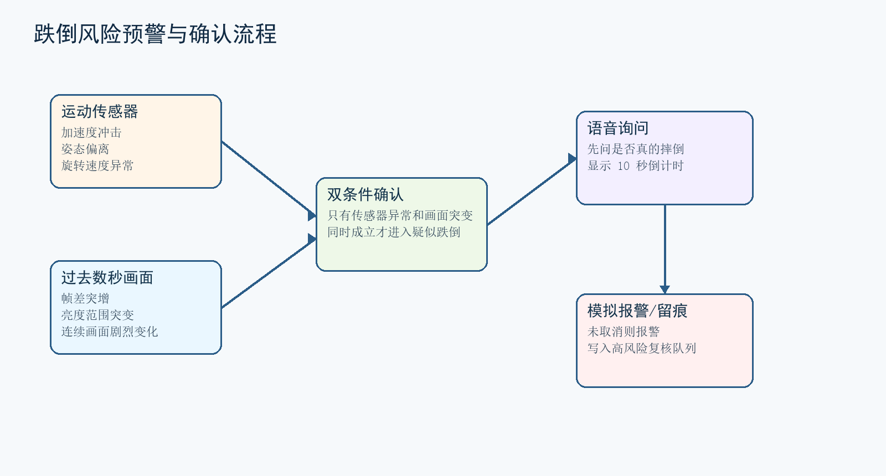
  <p><em>Figure 2: Fall Verification Workflow with Sensor Impact and Temporal Vision Dual-Confirmation</em></p>
</div>

<div align="center">
  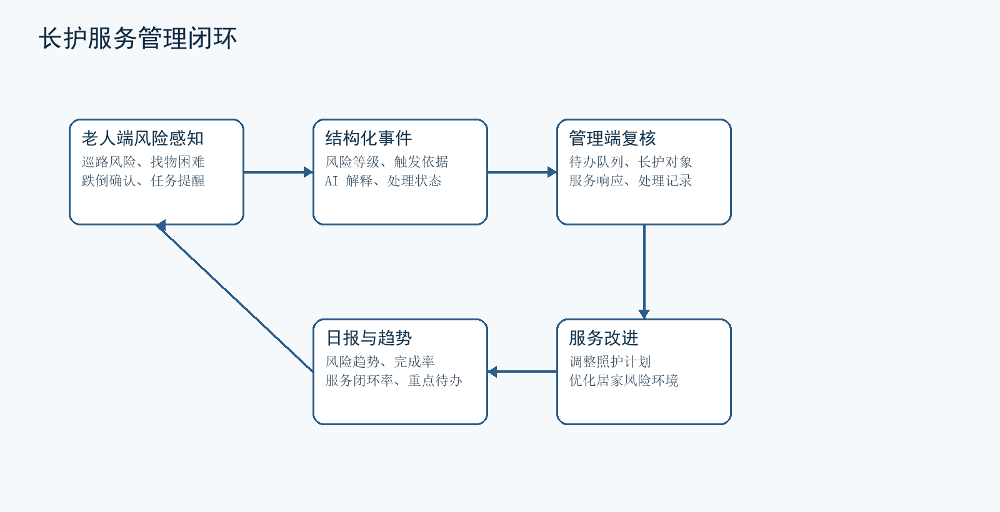
  <p><em>Figure 3: Long-Term Care Service Management & Anomaly Resolution Closed Loop</em></p>
</div>

| Mobile Care Dashboard | Desktop Management Console | Intelligent Data Assistant Chat |
| :---: | :---: | :---: |
| 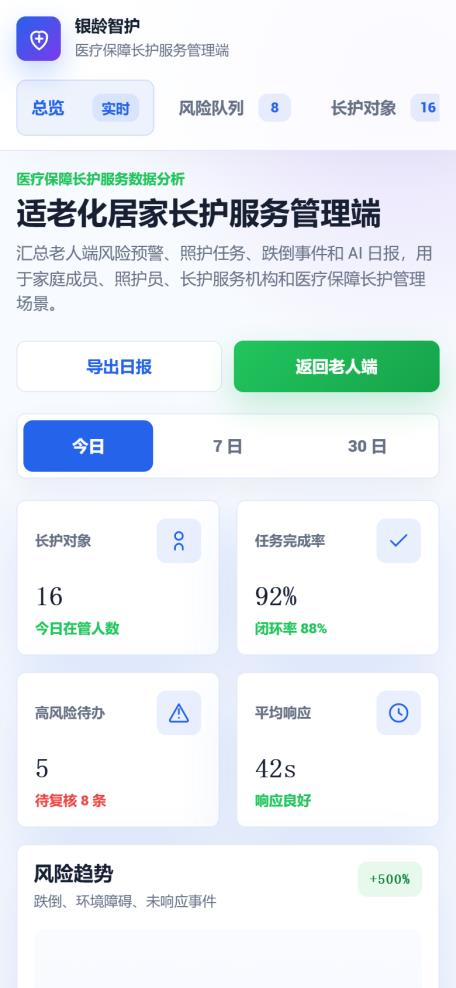 | 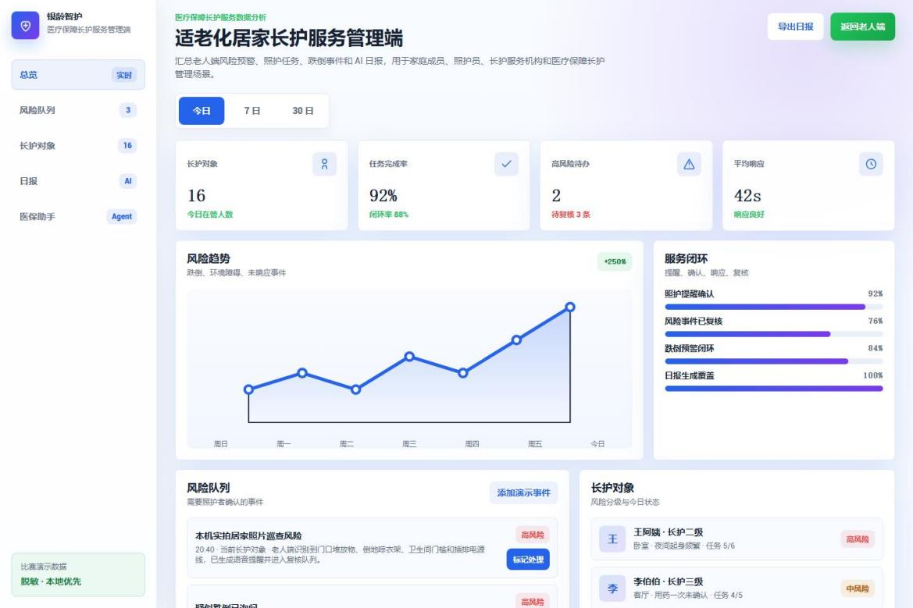 | 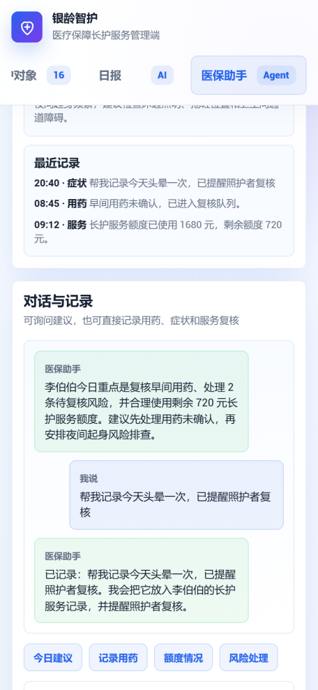 |
| **Function**: Mobile review of pending risk events, senior status indicators, and daily anomaly summaries. | **Function**: Multi-resident situation overview, pending inspection items, audit logging, and report exporting. | **Function**: Natural language QA for care policies, historical health telemetry, and daily care journals. |

---

## System Architecture

The system adopts a decoupled layered architecture ensuring seamless coordination among presentation interfaces, edge compute runtimes, hardware IO pipelines, and remote management services:

<div align="center">
  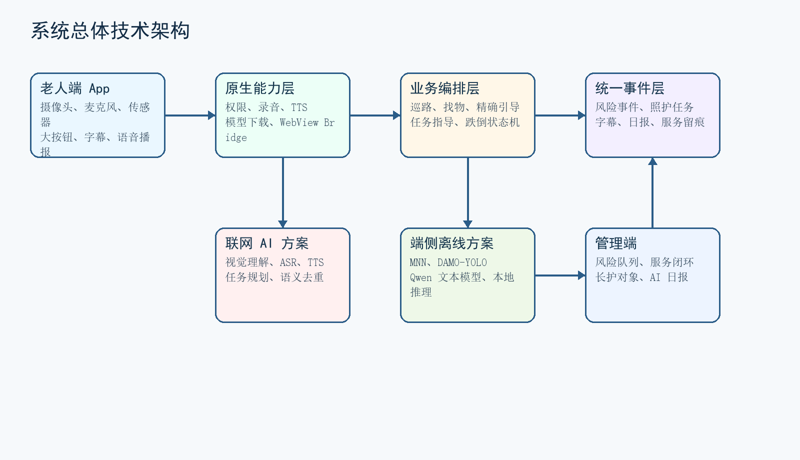
  <p><em>Figure 4: SilverCare Overall Layered Architecture</em></p>
</div>

### Architectural Layers

```text
┌────────────────────────────────────────────────────────────────────────┐
│                      Presentation Layer (User Interface)                │
│   Accessible Elderly WebView UI │ High-Contrast Subtitles │ Care Dashboards    │
└───────────────────────────────────┬────────────────────────────────────┘
                                    │ JavaScript Bridge
┌───────────────────────────────────▼────────────────────────────────────┐
│                         Native Platform Layer                          │
│   Android/iOS Permissions │ Continuous Camera Feed │ Audio Capture & TTS       │
│   6-Axis IMU Pipeline     │ Dynamic Model Loading  │ Network & Power Policies  │
└───────────────────────────────────┬────────────────────────────────────┘
                                    │
┌───────────────────────────────────▼────────────────────────────────────┐
│                     Orchestration & Business Logic                     │
│   Patrol Scheduler │ Spoken Homophone Corrector │ Action Decomposer │ Fall FSM │
└───────────────────┬────────────────────────────────┬───────────────────┘
                    │                                │
┌───────────────────▼──────────────┐ ┌───────────────▼───────────────────┐
│       Edge Offline Mode          │ │      Cloud-Enhanced Services      │
│  • MNN Inference Engine          │ │  • DashScope / Qwen Multimodal    │
│  • DAMO-YOLO Object Detector     │ │  • High-Precision Cloud ASR       │
│  • Qwen3-4B-Instruct-MNN Planner │ │  • High-Fidelity CosyVoice TTS    │
│  • Lightweight Local Vosk ASR    │ │  • Care Policy Knowledgebase RAG  │
└──────────────────────────────────┘ └───────────────────────────────────┘
```

---

## Edge-Cloud Coordination & Model Strategy

To balance low latency, user privacy, and high availability across varying network environments, the system implements an edge-first, cloud-enhanced unified operating strategy:

<div align="center">
  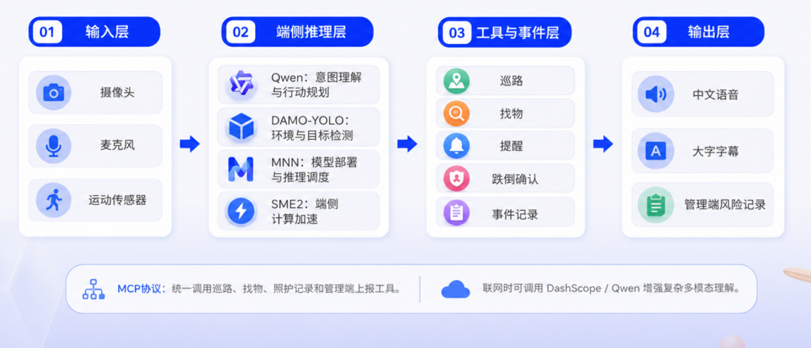
  <p><em>Figure 5: Edge-First, Cloud-Enhanced Architecture Design</em></p>
</div>

### Model Selection Matrix

| Functional Module | Edge Offline Solution | Cloud-Enhanced Solution | Performance & Resource Metrics |
| :--- | :--- | :--- | :--- |
| **Visual Object Detection** | `DAMO-YOLO Tiny (MNN)` | `Qwen-VL / DashScope Multi-Modal` | Desktop benchmark inference ~0.131s; mobile sustained throughput 15–30 FPS |
| **Language Intent & Planning** | `Qwen3-4B-Instruct-MNN` (Quantized) | `Qwen-Max / Qwen-Plus` | Downloaded on demand into app sandbox directory, maintaining minimal base APK size |
| **Speech-to-Text (ASR)** | `Vosk-Chinese-Small` | `DashScope Realtime ASR` | Low-power always-on offline wake-word and transcription; cloud invoked for complex queries |
| **Text-to-Speech (TTS)** | `Android System Native TTS / MNN TTS` | `CosyVoice / DashScope TTS` | Guarantees vital audio warnings offline; generates natural empathetic tone when online |

### Security & Secret Management

During local testing and integration, credentials must be supplied via external configuration files and never hard-coded into source control:

```properties
# Create local.properties in project root (protected by .gitignore)
DASHSCOPE_API_KEY=your_dashscope_api_key_here
```

---

## Build & Verification Guide

### 1. Android Workspace

Open the project root directory directly in Android Studio:

```bash
# Build debug APK
.\gradlew.bat :app:assembleDebug --no-daemon

# Run local JVM unit tests
.\gradlew.bat :app:testDebugUnitTest --no-daemon

# Run automated integration tests with live DashScope credentials
$env:DASHSCOPE_API_KEY="your_api_key"
.\gradlew.bat :app:testDebugUnitTest -Dsilvercare.liveDashScope=true --no-daemon
```

### 2. iOS Migration Workspace (`ios/`)

The iOS migration is built on SwiftUI and WKWebView, located in the `ios/` directory:

```bash
# Run syntax and static security checks
npm run check:js
npm run check:secrets

# Run frontend core logic test suite (19 test cases including subtitles, fall FSM, etc.)
npm run test:js

# Run iOS simulator automated checks
npm run test:ios:sim

# Run full migration verification gate
npm run verify:ios:migration
```

---

## Public Benchmark

The repository includes a standardized de-identified evaluation benchmark under `public_benchmark_silvercare/`:

1. **De-Identified In-Home Datasets**: Realistic image and audio samples across corridors, cluttered entryways, fallen barriers, wet bathroom tiles, and messy desks.
2. **Structured Evaluation Tasks**: Standardized protocols measuring navigation obstacle accuracy, item retrieval latency, fall confirmation confidence, and ASR homophone correction rate.
3. **Automated Scoring Scripts**: Baseline comparison scripts and metric evaluation routines for regression verification across model upgrades or hardware ports.

---

## Compliance & Disclaimer

1. **Assistive Positioning**: This system serves as an in-home mobility aid, environmental safety monitor, and care service tracking tool. It provides multidimensional perceptual support for seniors, family members, and caregivers.
2. **Non-Medical Disclaimer**: Guidance prompts and hazard assessments generated by the system do not constitute clinical medical diagnosis, therapeutic prescription, or emergency rescue certification. In life-threatening emergencies, immediately contact local emergency medical services.
3. **Privacy Protection**: In offline mode, all camera frame analysis and speech transcription are processed exclusively within local device memory without streaming images or audio to external servers, safeguarding household privacy.
