# SilverCare AI Assistant（银龄智护）

<div align="center">

**语音优先的无障碍居家照护辅助与风险预警系统**  
*面向低视力老人、独居老人和长期照护场景的多模态 AI 辅助系统*

[核心能力](#核心能力) • [实际场景与演示](#实际场景与演示) • [系统架构](#系统架构) • [端云协同与模型策略](#端云协同与模型策略) • [构建与验证指南](#构建与验证指南) • [公开基准测试](#公开基准测试) • [合规与免责声明](#合规与免责声明)

</div>

---

## 项目概述

**SilverCare AI Assistant（银龄智护）** 是一套专为低视力老人、独居老人、半失能照护对象、家庭照护者和长期照护管理人员设计的多模态人工智能系统。系统以普通智能手机作为感知和计算终端，整合手机摄像头、高灵敏度麦克风、六轴 IMU 传感器、端侧深度学习引擎以及可选的云端大语言模型服务，提供集 **“多模态环境感知 + 语音优先交互 + 居家行动引导 + 主动跌倒核验 + 闭环照护管理”** 于一体的综合解决方案。

当老人独自在家中走动时，系统提供清晰、可执行的语音行动引导和主动危险提醒。同时，系统为家属和专业照护人员提供可审计的事件复核记录。通过将连续的摄像头画面转化为触觉参照点和相对于身体的空间方向（例如 *“立即停下；向右迈步；扶住门框；用脚尖轻探地面；沿桌沿向前移动手”*），系统帮助行动受限或视力下降的人在保持安全与自主性的同时，完成夜间如厕、走廊通行、绕过障碍物和取物等必要的日常任务。

<div align="center">
  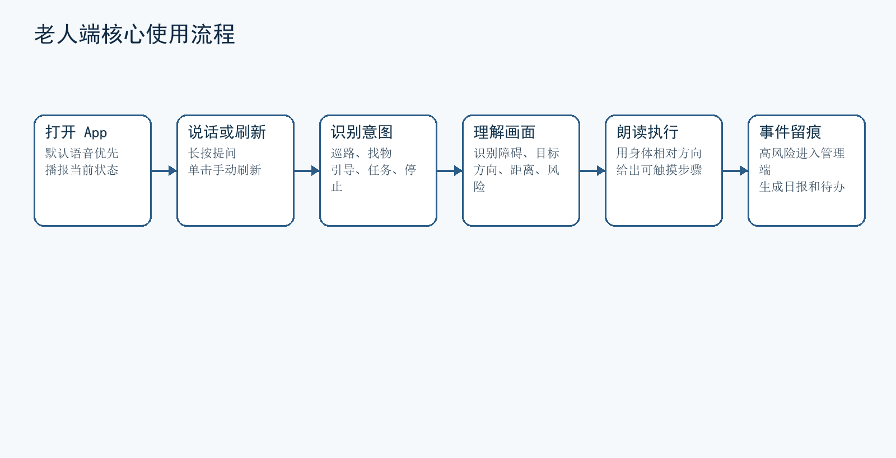
  <p><em>图 1：语音优先的老人端核心交互流程</em></p>
</div>

---

## 核心能力

- 🎙️ **语音优先的无障碍交互**：默认提供全流程语音提示、高对比度大字幕和加大的触控区域。支持长按说话、单击刷新和免手动自动播报，无需持续盯着屏幕也能流畅操作。
- 🚶 **夜间巡路与行动引导**：持续监测地面路径和通道，自动识别地垫、门槛、电线、楼梯和家具边缘，并生成简短的语音绕行指引。
- 🔍 **同音词纠错与语音找物**：帮助快速定位水杯、药瓶、钥匙和老花镜等日常用品。结合自动语音识别的语音纠错与物体检测，播报目标位置并提示附近同时存在的危险。
- 🤝 **精细动作引导**：使用相对于身体的方向和实体触觉参照点，辅助穿过狭窄门道、触及墙面开关以及拿取桌上物品等精细操作。
- 🛡️ **双重保障跌倒确认**：融合 IMU 加速度冲击峰值、异常身体倾斜角度和连续画面的视觉扰动。触发后，系统通过语音主动询问并启动 10 秒倒计时，过滤随手掉落设备或轻微抖动造成的误报。
- 📊 **闭环照护管理**：将移动端应用与桌面 Web 管理控制台连接，把危险警告、找物失败和紧急求助汇总为结构化台账，并自动生成供照护者核验的每日 AI 照护摘要。
- ⚡ **端侧优先的离线运行与云端协同**：通过 MNN Runtime + DAMO-YOLO + Qwen3 语言模型 + 轻量级本地 Vosk 语音识别实现完全离线运行，并可选择回退到 DashScope 多模态模型，以在弱网环境中保障隐私、低延迟和高可用性。

---

## 实际场景与演示

### 1. 居家巡路与夜间避障

在夜间低光照行走、狭窄走廊通行和杂物较多的通道穿行时，系统动态检测前方障碍物、估计相对距离，并播报简短的导航指令。

| 场景 A：走廊通行导航 | 场景 B：入口行李与障碍物警告 |
| :---: | :---: |
| 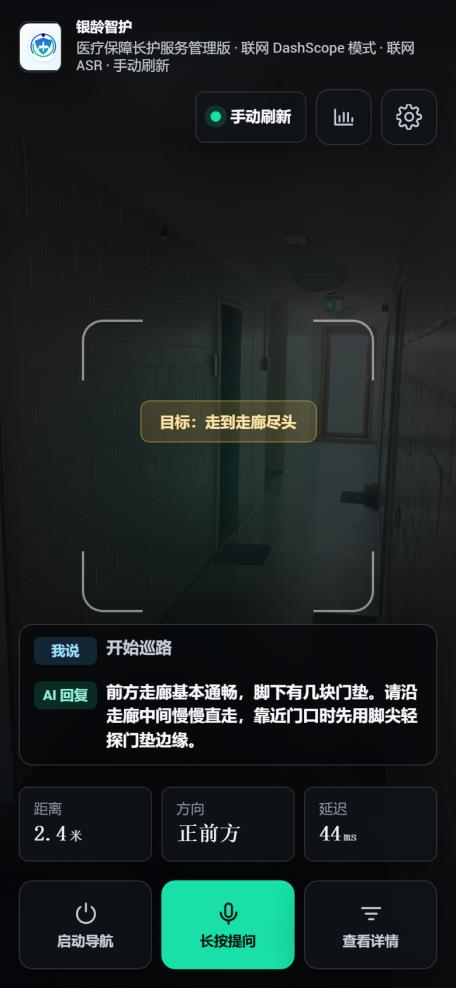 | 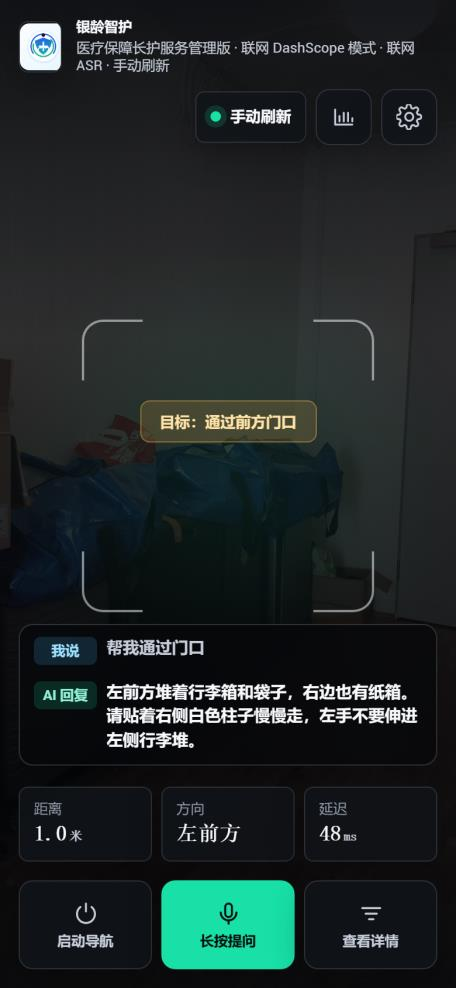 |
| **检测目标**：地垫、走廊通行深度<br>**语音引导**：*“沿走廊中间缓慢行走。前方有地垫，注意脚下。”* | **检测目标**：堆放在通道中的行李箱和包袋<br>**语音引导**：*“左前方堆放着行李。贴着右侧墙壁缓慢向前走。”* |

---

### 2. 危险警告与卫生间安全

针对常见的居家跌倒诱因（倒地物品、缠绕的电线、湿滑的卫生间地砖以及门槛高度差），系统提高警告优先级，引导老人减速并借助扶手支撑。

| 场景 C：绊倒危险警告 | 场景 D：卫生间湿滑与门槛安全 |
| :---: | :---: |
| 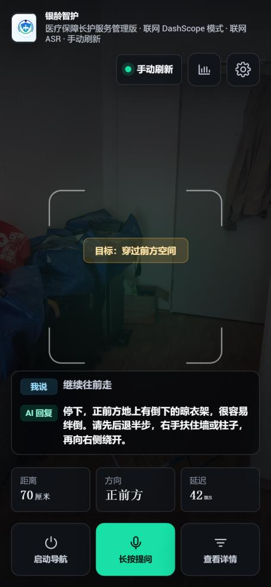 | 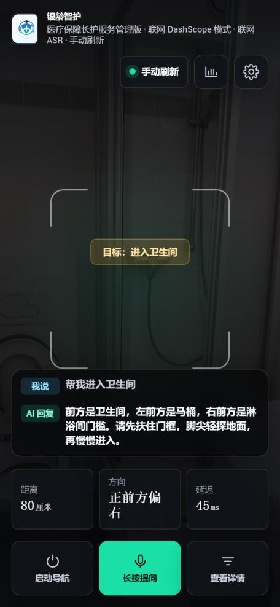 |
| **检测目标**：挡住道路的倒地金属晾衣架<br>**语音引导**：*“立即停下！正前方有倒地的金属架。后退半步，从右侧绕行。”* | **检测目标**：门槛高差、湿滑的卫生间地砖、马桶位置<br>**语音引导**：*“现在进入卫生间。扶稳门框，用脚尖探一探地面是否潮湿。”* |

---

### 3. 找物与精准动作引导

用户通过语音提问发起找物请求（例如 *“帮我找降压药”*、*“我的耳机盒在哪里？”*）。系统进行语音转写纠错、视觉边界框定位，以及对周围物品表面的危险分析。

| 场景 E：找物与插线板风险 | 场景 F：双重保障跌倒确认 |
| :---: | :---: |
| 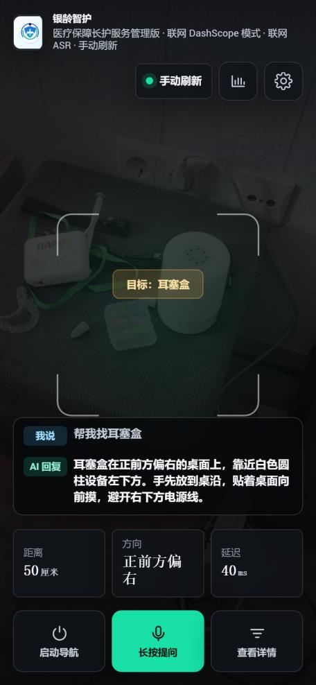 | 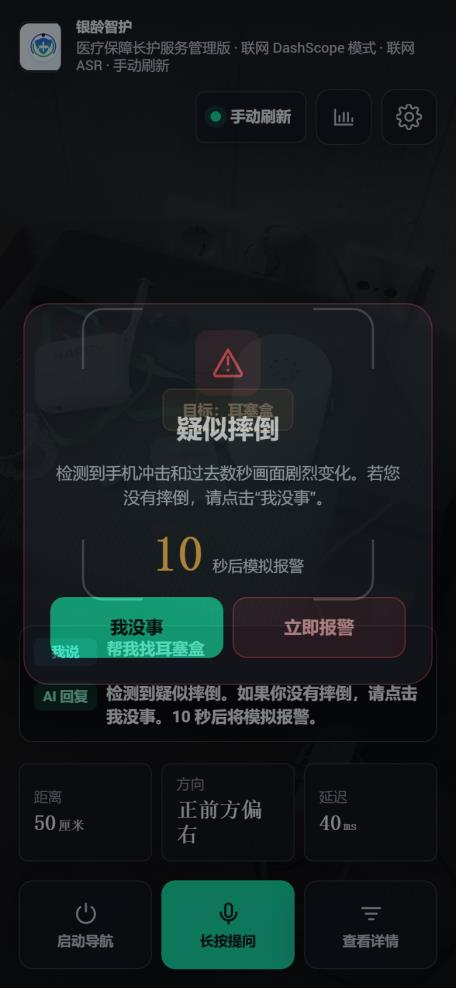 |
| **检测目标**：位于桌面右侧的耳机盒；附近有插线板<br>**语音引导**：*“耳机盒在前方桌面上，稍偏右。注意附近的插线板和电线，慢慢向前伸手。”* | **检测触发条件**：重力冲击 + 俯仰倾斜翻转 + 剧烈视觉运动<br>**处理流程**：显示 10 秒确认对话框，并大声询问 *“你跌倒了吗？”*。若没有回应，则升级通知紧急联系人。 |

---

### 4. 跌倒确认与闭环照护服务

系统汇总居家危险事件、报警日志和日常照护任务，为家属及长期照护服务提供者建立可审计的闭环。

<div align="center">
  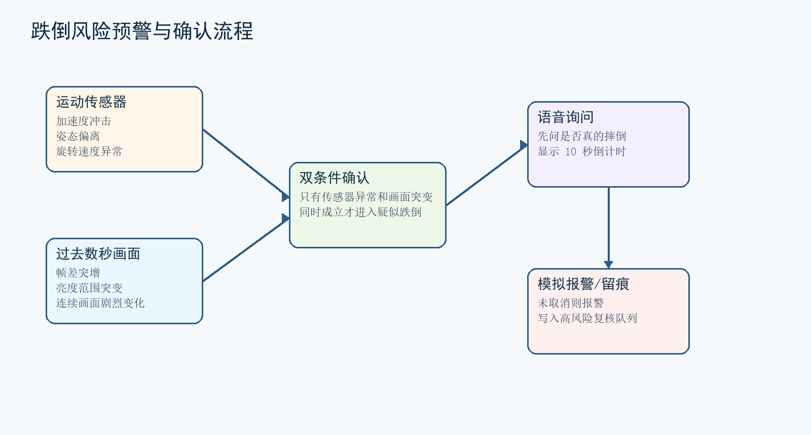
  <p><em>图 2：结合传感器冲击与连续视觉双重确认的跌倒核验流程</em></p>
</div>

<div align="center">
  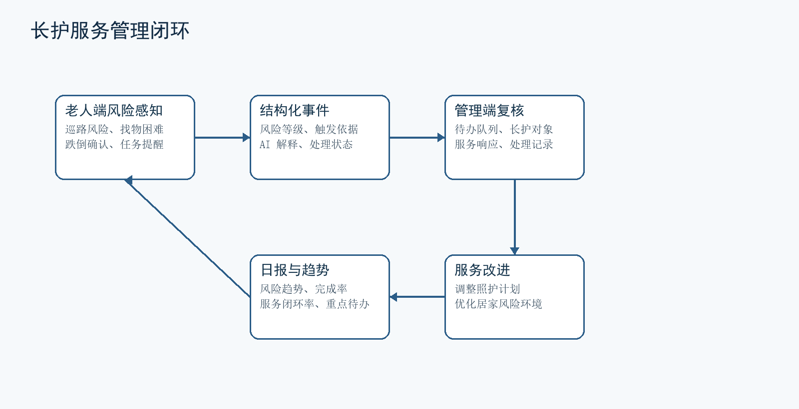
  <p><em>图 3：长期照护服务管理与异常处理闭环</em></p>
</div>

| 移动端照护看板 | 桌面管理控制台 | 智能数据助手对话 |
| :---: | :---: | :---: |
| 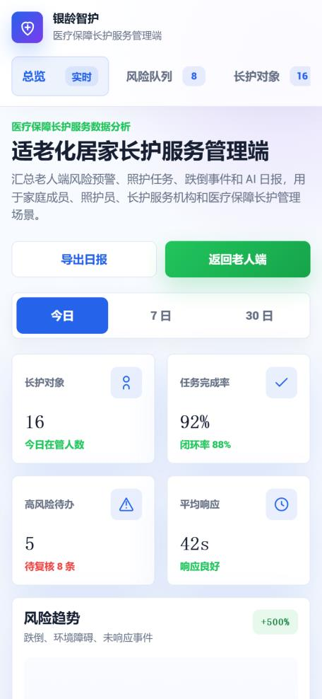 | 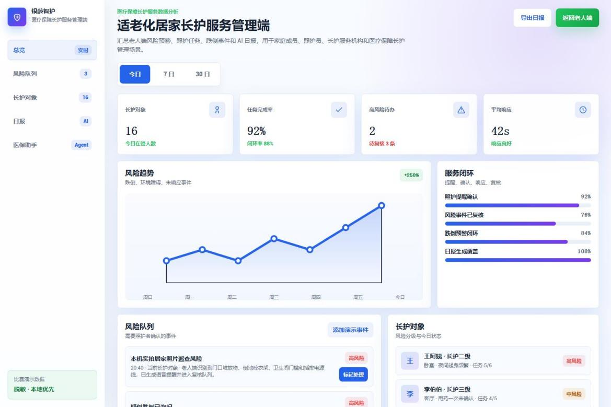 | 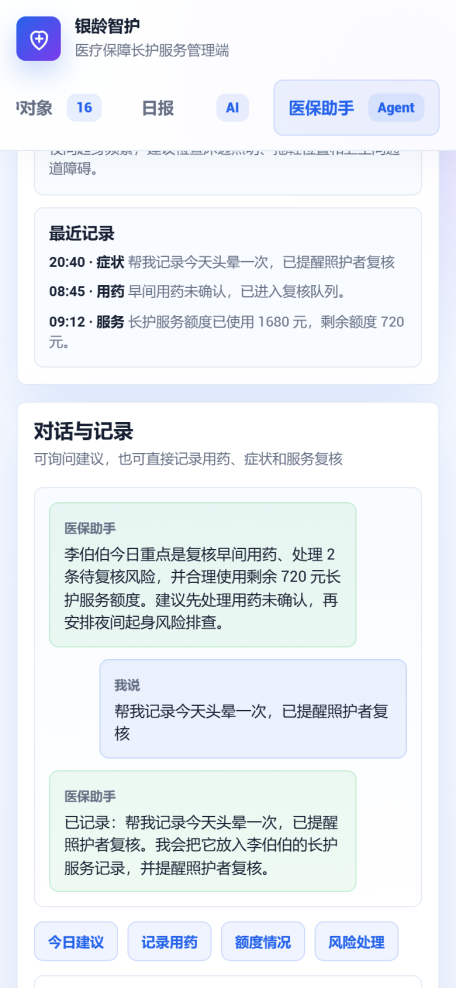 |
| **功能**：在移动端查看待处理风险事件、老人状态指标和每日异常摘要。 | **功能**：查看多名老人状况概览、待检查事项、审计日志并导出报告。 | **功能**：用自然语言问答查询照护政策、历史健康监测数据和每日照护日志。 |

---

## 系统架构

系统采用解耦的分层架构，使展示界面、端侧计算运行时、硬件输入输出流程与远程管理服务之间无缝协同：

<div align="center">
  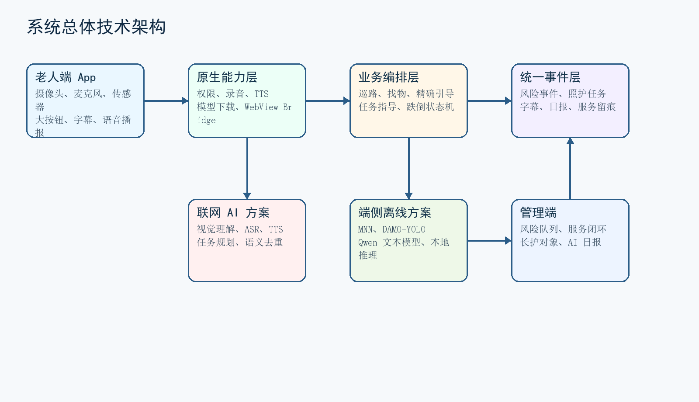
  <p><em>图 4：银龄智护整体分层架构</em></p>
</div>

### 架构层次

```text
┌────────────────────────────────────────────────────────────────────────┐
│                          展示层（用户界面）                            │
│       适老化无障碍 WebView 界面 │ 高对比度字幕 │ 照护看板              │
└───────────────────────────────────┬────────────────────────────────────┘
                                    │ JavaScript 桥接
┌───────────────────────────────────▼────────────────────────────────────┐
│                            原生平台层                                  │
│       Android/iOS 权限 │ 连续摄像头画面 │ 音频采集与语音合成          │
│       六轴 IMU 流程   │ 动态模型加载   │ 网络与电源策略              │
└───────────────────────────────────┬────────────────────────────────────┘
                                    │
┌───────────────────────────────────▼────────────────────────────────────┐
│                          编排与业务逻辑                                │
│       巡路调度器 │ 语音同音词纠错器 │ 动作分解器 │ 跌倒状态机           │
└───────────────────┬────────────────────────────────┬───────────────────┘
                    │                                │
┌───────────────────▼──────────────┐ ┌───────────────▼───────────────────┐
│           端侧离线模式           │ │           云端增强服务            │
│  • MNN 推理引擎                  │ │  • DashScope / Qwen 多模态        │
│  • DAMO-YOLO 物体检测器          │ │  • 高精度云端语音识别             │
│  • Qwen3-4B-Instruct-MNN 规划器  │ │  • 高保真 CosyVoice 语音合成      │
│  • 轻量级本地 Vosk 语音识别      │ │  • 照护政策知识库 RAG            │
└──────────────────────────────────┘ └───────────────────────────────────┘
```

---

## 端云协同与模型策略

为在不同网络环境下兼顾低延迟、用户隐私和高可用性，系统采用端侧优先、云端增强的统一运行策略：

<div align="center">
  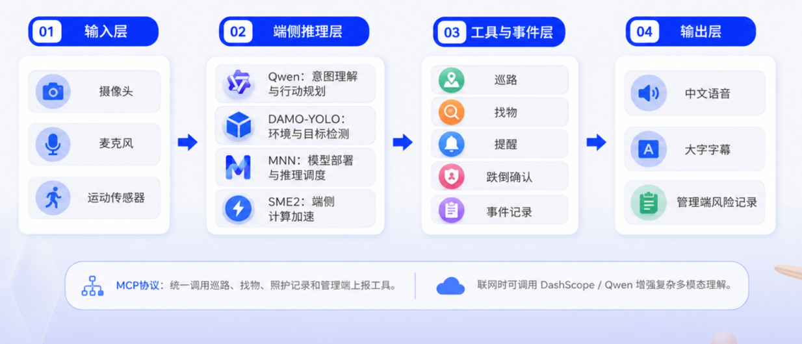
  <p><em>图 5：端侧优先、云端增强的架构设计</em></p>
</div>

### 模型选型矩阵

| 功能模块 | 端侧离线方案 | 云端增强方案 | 性能与资源指标 |
| :--- | :--- | :--- | :--- |
| **视觉物体检测** | `DAMO-YOLO Tiny (MNN)` | `Qwen-VL / DashScope Multi-Modal` | 桌面端基准推理时间约 0.131 秒；手机端持续吞吐量 15–30 FPS |
| **语言意图与规划** | `Qwen3-4B-Instruct-MNN`（量化） | `Qwen-Max / Qwen-Plus` | 按需下载到应用沙盒目录，保持基础 APK 体积最小化 |
| **语音转文字（ASR）** | `Vosk-Chinese-Small` | `DashScope Realtime ASR` | 低功耗、持续运行的离线唤醒词识别与转写；复杂查询调用云端 |
| **文字转语音（TTS）** | `Android System Native TTS / MNN TTS` | `CosyVoice / DashScope TTS` | 离线保障重要语音警告；联网时生成自然、富有同理心的语音 |

### 安全与密钥管理

在本地测试和集成过程中，凭证必须通过外部配置文件提供，绝不能硬编码到源码管理中：

```properties
# 在项目根目录创建 local.properties（受 .gitignore 保护）
DASHSCOPE_API_KEY=your_dashscope_api_key_here
```

---

## 构建与验证指南

### 1. Android 工作区

直接在 Android Studio 中打开项目根目录：

```bash
# 构建 debug APK
.\gradlew.bat :app:assembleDebug --no-daemon

# 运行本地 JVM 单元测试
.\gradlew.bat :app:testDebugUnitTest --no-daemon

# 使用真实 DashScope 凭证运行自动化集成测试
$env:DASHSCOPE_API_KEY="your_api_key"
.\gradlew.bat :app:testDebugUnitTest -Dsilvercare.liveDashScope=true --no-daemon
```

### 2. iOS 迁移工作区（`ios/`）

iOS 迁移版本基于 SwiftUI 和 WKWebView 构建，位于 `ios/` 目录：

```bash
# 运行语法和静态安全检查
npm run check:js
npm run check:secrets

# 运行前端核心逻辑测试套件（19 个测试用例，包括字幕、跌倒状态机等）
npm run test:js

# 运行 iOS 模拟器自动化检查
npm run test:ios:sim

# 运行完整的迁移验证门禁
npm run verify:ios:migration
```

---

## 公开基准测试

仓库在 `public_benchmark_silvercare/` 下包含一套标准化的脱敏评估基准：

1. **脱敏居家数据集**：涵盖走廊、杂乱入口、倒地障碍物、潮湿的卫生间地砖和凌乱桌面的逼真图像与音频样本。
2. **结构化评估任务**：测量导航障碍物识别准确率、找物耗时、跌倒确认置信度和自动语音识别同音词纠错率的标准化协议。
3. **自动化评分脚本**：用于在模型升级或硬件移植后进行回归验证的基线对比脚本和指标评估流程。

---

## 合规与免责声明

1. **辅助定位**：本系统用作居家行动辅助工具、环境安全监测工具和照护服务追踪工具，为老人、家属和照护人员提供多维感知支持。
2. **非医疗免责声明**：系统生成的引导提示和危险评估不构成临床医学诊断、治疗处方或紧急救援认证。在危及生命的紧急情况下，请立即联系当地急救服务。
3. **隐私保护**：在离线模式下，所有摄像头画面分析和语音转写均仅在本地设备内存中处理，不会将图像或音频流式传输到外部服务器，以保护家庭隐私。
